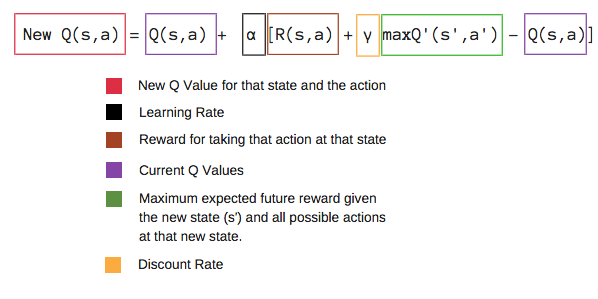
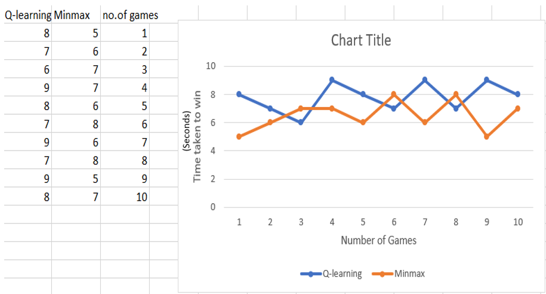

# Final Project
## Comparison of Tic-tac-toe Game with Minmax algorithm and Q-Learning Algorithm
### Introduction

*	Tic-tac-toe also known as noughts and crosses or X’s and O’s is a two players game in which player can choose either X or O, who take turns marking the spaces in a 3×3 grid. The player who succeeds in placing three of their marks in a horizontal, vertical, or diagonal row is the winner.
* Tic-Tac-Toe game is written in Python and pyGame. You can play versus the computer.
*	We implement tic-tac-toe by using both Minmax and Q-learning Algorithms.

### Goal of the project
*	The main goal of the project is to compare the tic tac toe game using 2 algorithms
Minmax Algorithm and Q-learning Algorithm
*	By evaluating both the algorithms considering the complexity of code and time taken to complete as the key factors. Finally, we will select the best Algorithm to implement the tic tac toe game

### Minmax Algorithm
<h3 align="center">

 </h3>   
 
As shown in the figure the maximiser and minimizer are two recursive functions which accepts the state as a variable.
In the maximizer it first checks whether the state is terminal state i.e end state then it return its utility.
If the state is not terminal state it 
* Define v as negative infinity and  it call its’s own function for the v by passing result of next possible state and action.
* The loop continues until it reaches the terminal state
* The same thing going to happen in maximiser recursive function except defining v as positive infinity for the maximiser.

### Q-learning Algoritm
<h3 align="center">

</h3> 

We will first build a Q-table. 
Action (a) in the state (s) based on the Q-Table. But, as mentioned earlier, when the episode initially starts, every Q-value is 0.
 The robot will explore the environment and randomly choose actions. The logic behind this is that the robot does not know anything  the environment.
As the robot explores the environment, the epsilon rate decreases and the robot starts to exploit the environment.
During the process of exploration, the robot progressively becomes more confident in estimating the Q-values.
Now we have taken an action and observed an outcome and reward.We need to update the function Q(s,a).

                                               
### Winnings Of Minmax

In mimmax game the human wins 2 times 
computer wins 6 times and 2 times the game is tie
* this clearly shows that Minmax Algorithm gives tough competetion to the users

### Winnings of Q-learning Algorithm

In the q-learning game there are 4 human wins 4 computer wins and 2 ties

### Comparosion of Results ( MinmMax vs Q-learning)

The graph with seconds as y axis and games as x-axis the orange represents the minmax and blue line represents q-learning out of 10 games minmazx agent has completed the game 7 times in less time than qlearning algorithm 
* Tis clearly shows that Minmax takes less time to complete the game than Q-learning Algorithm.

### Results 
Minmax Algorithm is the best algorithm for the implementation of the Tic-Tac-Toe game. As the time taken to complete the game is less and it gives tough competition to the user.
